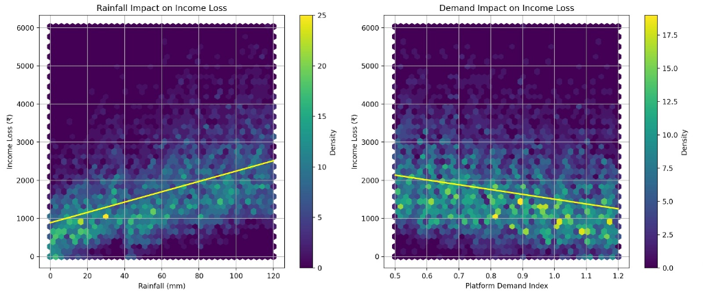
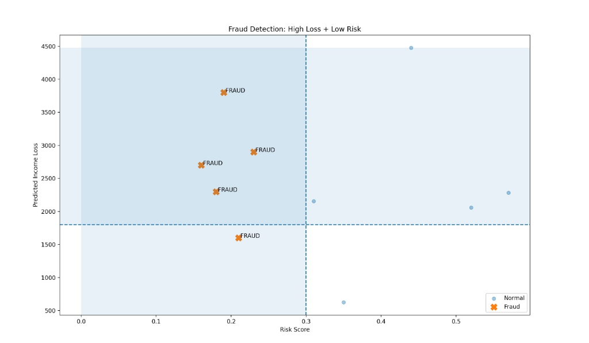
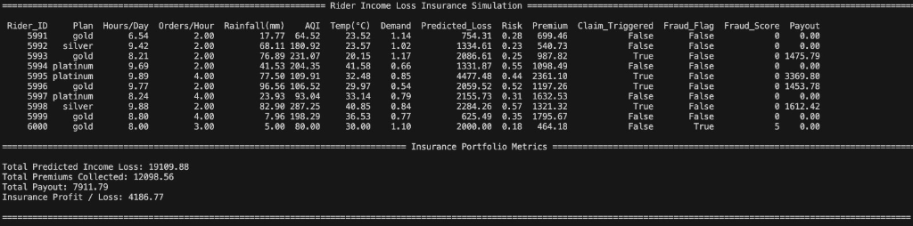

# Parity - AI-Parametric Insurance Platform (Hackathon Ready)

A production-ready insurance platform for India's gig economy delivery partners, featuring parametric triggers, fraud detection, and instant payouts. Built with Golang microservices, Python ML risk prediction, and a React Native frontend.

**⚡ Hackathon Highlights:**
- **Zero-Touch Claims:** PostGIS + Weather Oracles automate payouts.
- **Dynamic Risk Pricing:** Integrated ML (`/risk/location`) evaluates live weather & traffic risk during user onboarding.
- **Hardware Integrations:** React Native device fingerprinting prevents GPS spoofing.
- **Live Over-The-Air Updates:** EAS deployment pipeline for rapid hackathon lifecycle iteration.


## What is Parity?

Parity is a parametric insurance platform that automatically compensates gig workers when real-world disruptions (rain, traffic, pollution) reduce their earning ability.

- No claims filing  
- No paperwork  
- Instant payouts triggered by real-world data  

**Example:**  
Rainfall > 40mm → System detects disruption → ₹280 credited automatically

## Problem

Gig workers lose income due to:
- Sudden rain
- Traffic collapse
- Extreme heat

- No compensation  
- No safety net  
- No predictable income  

Even 2–3 hours of disruption = significant daily loss


### Market Opportunity

The gig economy in India is projected to reach 23.5 million workers by 2030. Currently, over 90% of these individuals operate without any form of income protection against environmental disruptions. 

Traditional insurance products fail this demographic because:
- **High Operational Costs:** Processing a manual claim for a low-value payout (e.g., ₹250) is economically unviable for incumbent insurers.
- **Data Gap:** Legacy systems cannot track hyper-local disruptions with the precision required for high-frequency, low-ticket claims.

Parity bridges this billion-dollar gap by automating the entire lifecycle, reducing operational overhead to near-zero.

## Why Parametric Insurance?

Traditional insurance:
- Requires manual claims
- Slow payouts
- High fraud risk

Parity:
- Uses real-world data triggers
- Automates claim validation
- Pays instantly without user action

## What Makes Parity Different?

- Zero-touch payouts (no claim filing)
- Real-time trigger detection
- Fraud-resistant via multi-signal validation
- Built specifically for gig economy workflows
- Micro-pricing (weekly, affordable)

## Example Flow (Zero-Touch Execution)

1. **The Disruption:** Raj is delivering in Saket (Zone DEL-SAKET-01). Sudden, severe rainfall hits, logging 55mm sustained over 45 minutes.
2. **Parametric Trigger:** The Weather API detects the threshold breach (`> 40mm`). The Claim Processing Service automatically queues affected riders logged within that specific 3km polygon using PostGIS geo-fencing.
3. **The Private API Handshake:** Parity executes a sub-second ping to the gig platform using Raj’s OAuth token: *"Was Raj logged in and active in Saket?"* (Returns: `True`).
4. **Intelligent Fraud Gatekeeper:** The system runs real-time multi-layer checks: Device integrity is solid, IP matches GPS, and 45 other riders are experiencing identical delays (Crowdsource Confidence). Fraud Score = 0.
5. **Income Prediction:** The XGBoost model calculates Raj's expected income loss based on his historical delivery velocity vs. the 45-minute delay.
6. **Instant Resolution:** ₹280 is computed and automatically credited to Raj's account wallet with an immediate push notification.

No manual claim. No paperwork. Just a seamless safety net.

Watch the zero-touch execution in action:

https://drive.google.com/file/d/1NhmiGG2r4uddoijGIw7DhH0LVWF7bvqo/view?usp=drivesdk

*Simulation: Heavy rainfall detected in Saket. Raj receives an instant credit notification without opening the app.*

## Screenshots

<div align="center">
  
  
  
</div>

## Architecture Overview


### Technology Stack


#### Why This Stack?
- **Golang (Backend):** Chosen for its superior concurrency model (Goroutines). Essential for polling thousands of hyper-local weather/traffic APIs in parallel for real-time monitoring.
- **PostgreSQL + PostGIS:** Provides industrial-grade ACID compliance for financial integrity, with PostGIS enabling the precise 3-5 km geospatial geo-fencing required for parametric triggers.
- **Redis:** Acts as a high-speed volatile cache for "Active Session" tokens and live disruption flags, enabling sub-second "Zero-Touch" payout validation.
- **XGBoost (Python):** Utilized for its high-performance gradient boosting capabilities, accurately predicting non-linear income loss.
- **React Native + Expo EAS:** Ensures a high-performance cross-platform mobile experience. We leverage Expo Application Services (EAS) for instant Over-The-Air (OTA) production updates—critical for live hackathon demos without app store hurdles.

### Data Flow - Parametric Event Processing

```text
1. External API Trigger
   └─> Parametric Event (Rainfall > 40mm)
       └─> Claim Service receives event
           └─> Find affected users in zone
               └─> For each user:
                   ├─> Run Fraud Detection
                   │   ├─> GPS Verification
                   │   ├─> Device Integrity Check
                   │   └─> Claim Clustering
                   │
                   ├─> Calculate Income Loss
                   │   └─> avg_hourly_rate × disruption_hours
                   │
                   ├─> Apply Payout Formula
                   │   └─> min(estimated_loss, coverage_limit)
                   │
                   ├─> Create Claim Record
                   │
                   └─> Process Payout
                       └─> Send Notification
```

### Microservice Data Schemas


#### 1. User Service Schema (Identity & Trust)
Stores the "Trust Baseline" for every rider to prevent GPS spoofing and identity fraud.
- `User_ID` (UUID): Primary Key.
- `Platform_Partner_ID` (String): Foreign key linking to the gig company (Zomato/Swiggy) for the Private API Tie-up.
- `Verification_Token` (Hashed): Digital signature from the gig platform verifying "Active Session" status.
- `Device_Fingerprint` (JSON): Stores hardware UUID, OS version, and Root/Jailbreak status.
- `Trust_Score` (Float): Dynamic value (0.0–1.0) updated nightly based on historical claim honesty.
- `Zone_Cluster_ID` (String): Maps the rider to a specific 3–5 km delivery zone for aggregate risk calculation.
- `Historical_Income_Profile` (JSON): Rolling 8-week average of deliveries/hour and avg weekly earnings (Expected Income baseline).

#### 2. Policy Service Schema (Dynamic Coverage)
Handles the weekly pricing model and the "cooling-off" period for plan upgrades.
- `Policy_ID` (UUID): Primary Key.
- `Plan_Tier` (Enum): SILVER, GOLD, PLATINUM.
- `Base_Premium` (Decimal): The standard weekly cost (e.g., ₹60, ₹85, ₹115).
- `Risk_Surcharge` (Decimal): Dynamic add-on based on location risks (e.g., +₹55 for flood zones).
- `Coverage_Multiplier` (Float): 0.50 (Silver/Gold) or 0.55 (Platinum).
- `Effective_Date` / `Expiry_Date`: Strictly defined as a 7-day window.
- `Upgrade_Lock_Until` (Timestamp): Ensures new coverage upgrades activate after a 2-week cooling-off period.
- `Exclusions` (JSONB): Standard exclusions array (War, Pandemic, Terrorism, Nuclear events) for all policies.

#### 3. Claim Processing Schema (Automated Payout Engine)
Critical schema for Parametric Automation connecting real-time triggers to financial loss.
- `Claim_ID` (UUID): Primary Key.
- `Trigger_Type` (Enum): WEATHER, AQI, TRAFFIC, SOCIAL_DISRUPTION.
- `Parametric_Metric_Value` (Float): Actual API value hitting the trigger (e.g., "Rainfall: 45mm").
- `Fraud_Score_Metadata` (JSON): Breakdown of the Fraud Scoring Model (e.g., gps_mismatch_score, movement_consistency).
- `Crowdsource_Confidence` (Int): Count of other riders in the same zone reporting the disruption.
- `Calculated_Loss` (Decimal): `min(coverage_limit, estimated_income_loss)`.
- `Payout_Status` (Enum): INITIATED, VERIFIED, PAID, FLAGGED_FOR_FRAUD.

#### 4. Notification Service Schema (Engagement & Alerts)
Ensures transparency and fulfills the "Earnings Protected" dashboard metric.
- `Notification_ID` (UUID): Primary Key.
- `Alert_Category` (Enum): EARLY_WARNING, CLAIM_TRIGGERED, PAYOUT_SUCCESS, FRAUD_WARNING.
- `Delivery_Status` (Boolean): Verifies the rider received early warnings.
- `Poll_Response` (Boolean/Nullable): Stores feedback for poll-based validation ("Is Saket Market blocked?").


- **High-Speed Caching:** Redis used for Claim Processing to store "Live Triggers" and "Active Session" tokens for sub-second zero-touch payout validation.
- **Audit Logging:** Every state change in `Claim_ID` is logged with timestamps to pass regulatory/compliance checks.

### Trigger Rules & Disruption Monitoring (Indian Conditions)
To account for hyper-local environmental factors and unpredictable social disruptions (e.g., severe monsoons, extreme Delhi heat), the system utilizes a robust disruption monitoring system for 3–5 km zones.

#### 1. Trigger Rule Definition (The Logic)
Thresholds sensitive to Indian metropolitan intensity.
- `Rule_ID` (UUID): Primary Key.
- `Trigger_Type` (Enum): HEAVY_RAIN, AQI_HAZARD, HEAT_WAVE, MOBILITY_COLLAPSE, SOCIAL_STRIKE.
- **Thresholds:**
  - Rainfall: `> 40mm` (Flooding proxy)
  - AQI: `> 500` (Severe pollution hazard)
  - Traffic Speed: `< 10 km/h` (Mobility collapse)
  - Temperature: `> 45°C` (Dangerous heat)
- `Sustain_Period` (Minutes): Required breach duration (e.g., 30 mins) before triggering a claim, avoiding false positives.
- `Indian_Context_Weight` (Float): Multiplier based on historical zone data (e.g., higher weight for waterlogging-prone zones).

#### 2. Disruption Event Schema (The Live State)
Tracks active disruptions and feeds data directly into the Income Loss Predictor.
- `Event_ID` (UUID): Primary Key.
- `Zone_Cluster_ID` (String): Delivery hub mapping (e.g., "DEL-SAKET-01").
- `Active_Metric_Value` (Float): Real-time external API reading.
- `Crowdsource_Verification_Count` (Int): Tally of manual hazard reports.
- `Source_Reliability_Score` (Float): Cross-references APIs against local news or rider crowdsourcing.
- `Probability_of_Disruption` (Float): 0.0–1.0 output driving the Fraud Detection layer.

#### 3. Zone-Specific Risk Meta (The Indian Condition Layer)
Provides deep geographic nuance.
- `Zone_Flood_History` (Boolean): Flags zones prone to "Sudden Waterlogging".
- `Market_Type` (Enum): `HIGH_ORDER_DENSITY` vs. `RESIDENTIAL`. Helps gauge income loss severity.
- `Social_Sensitivity_Index` (Float): Rating for areas prone to curfews or sudden strikes (Section 144), prompting proactive tracking.
- 
- **Concurrency (Goroutines):** Poll weather and traffic data across thousands of zones in parallel.
- **Real-time Handshake:** Emit events via a message queue (Kafka/BullMQ) to Claim Processing for zero-touch payouts.
- **Geo-Fencing:** Use PostGIS within PostgreSQL to strictly define 3-5 km polygons, ensuring unaffected zones don't incorrectly trigger payouts.


## Core Models & Machine Learning

### Solution Architecture
The system follows a modular pipeline:
1. Synthetic data generation based on realistic delivery ecosystem parameters.
2. Machine learning model training to predict income loss.
3. Risk scoring using environmental and operational indicators.
4. Fraud detection through rule-based anomaly identification.
5. Premium calculation using income, risk, and plan-based adjustments.
6. Claim triggering based on predefined environmental thresholds.
7. Payout computation with deductibles, coverage limits, and fraud filtering.
8. Portfolio-level performance analysis.

### Dataset Description
The dataset is synthetically generated to reflect realistic delivery conditions and includes:

| Feature | Description |
|---------|-------------|
| `hours_per_day` | Working hours per day |
| `orders_per_hour` | Delivery throughput |
| `days_per_week` | Weekly work frequency |
| `earnings_per_order` | Earnings per delivery |
| `rainfall_mm` | Rainfall intensity |
| `restaurant_density` | Availability of nearby orders |
| `peak_hour_ratio` | Fraction of work during peak hours |
| `platform_demand_index` | Platform demand indicator |
| `surge_multiplier` | Surge pricing factor |
| `aqi` | Air Quality Index |
| `temperature` | Ambient temperature |
| `expected_income` | Ideal income under normal conditions |
| `actual_income` | Realized income |
| `income_loss` | Difference between expected and actual income |

### Machine Learning Model
- **Model:** XGBoost Regressor
- **Objective:** Predict income loss based on rider and environmental features
- **Input:** Structured tabular data
- **Output:** Continuous income loss value



The model captures non-linear relationships between environmental conditions and earning potential.

### Risk Scoring
Risk is computed as a normalized score in the range `[0, 1]`, based on:
- Rainfall intensity
- AQI levels
- Temperature extremes (Delhi-calibrated thresholds)
- Platform demand index
- Restaurant density
- Peak hour engagement

The scoring function is designed to reflect localized environmental realities, particularly in high-variance urban settings.

### Premium Selection & Calculation
Each rider is assigned a plan option (Silver, Gold, Platinum):

| Plan | Coverage | Loading | Notes |
|------|----------|---------|-------|
| Silver | 50% | Low | Baseline protection |
| Gold | 50% | Medium | Baseline protection with additional benefits |
| Platinum | 55% | High | Higher coverage, controlled insurer exposure |

Premium depends on:
1. Expected weekly income
2. Coverage level (based on plan)
3. Risk score (non-linear scaling)
4. Plan loading

**Formula:**
- `Base Premium = Expected Weekly Income × Coverage`
- `Risk Multiplier = 1 + (Risk ^ 1.5)`
- `Premium = Base Premium × Risk Multiplier × Plan Loading`

### Advanced Fraud Detection
To build a "Unicorn-tier" platform, the Intelligent Fraud Detection system acts as a multi-layer "Gatekeeper" to ensure that only honest riders receive payouts, protecting the platform's capital during massive weather events.





#### Layer 1: The Device & Identity Layer (Pre-Claim Validation)
This layer ensures the integrity of the hardware and the person holding it before any claim is processed.
- **Live Security Handshake:** During onboarding, the React Native app captures a `DeviceFingerprint` payload (hardware UUIDs, OS specs). This is securely bound to the rider's Postgres profile.
- **Integrity Checks:** The User Service automatically detects Rooted (Android) or Jailbroken (iOS) states, shielding the platform from "Background Emulators" or "Auto-Clicker" location spoofers.
- **Biometric Enforcement:** For high-value payouts (Platinum tier), the app prompts for a local biometric check at the moment of the trigger.

#### Layer 2: The Geo-Spatial & Disruption Layer (Real-Time Validation)
This layer cross-references the rider's physical movement against the parametric disruption data.
- **Mock Location Detection:** Flags the use of "Fake GPS" apps by comparing GPS-reported location against IP-based network location.
- **Speed-Up Location Logic:** Tracks rider speed between pings. Impossible movements (e.g., 10km in two minutes to enter a "Heavy Rain" zone) are flagged.

> ### Future Vision: The Private API Handshake (Gig Platform Tie-Up)
> 
> *Today, Parity achieves **best-in-class fraud detection** as a completely independent, private organization—relying entirely on our robust, multi-layered device, spatial, and crowdsourced signals to ensure accuracy without external dependency. However, to secure an **impenetrable, Diamond-tier level of validation in the future**, a direct Tie-Up with gig platforms is a highly planned, necessary leap.*
> 
> **The Proposed Lightweight Verification Layer:**
> - **OAuth Onboarding:** Riders would log into their gig app once via OAuth to generate a securely **Hashed Verification Token**.
> - **Zero-Trust Verification Call:** When a parametric trigger fires, Parity's Claim Service would ping the platform’s Private API using the token to ask only binary (True/False) queries:
>   - **Active Status:** *"Was User ID actively 'Ready for Orders' during the disruption?"*
>   - **Zone Integrity:** *"Is the user currently assigned to the specific target delivery cluster?"*
> - **Current Fallback (Live System):** Until this tie-up is realized, Parity successfully utilizes **AI-based OCR validation** to cross-examine baseline income against earnings screenshots, preventing manual tampering with strict accuracy.
> - **Platform Value Add:** Parity solves the critical "Rider Attrition" crisis without transferring financial liability to the gig platform. The platform simply provides data validation, instantly enhancing their corporate reputation for worker welfare.
> - **Constraints:** This operates under **strict zero data mining** protocols. No PII is shared—only restricted Time, Location, and Activity states.

#### Layer 3: The Social & Crowdsourced Layer (The Verification Engine)
If a platform refuses a tie-up, or for augmenting general checks, this layer uses a "Hybrid Parametric Model."
- **Claim Clustering:** Over-reporting by a single rider while hundreds of others successfully deliver in the same zone flags an outlier.
- **Poll-Based Validation:** For manual claims, a quick poll is sent to other riders in the area (e.g., "Is Saket Market blocked?"). If >60% confirm, the disruption is validated for the zone.
- **Probability-Weighting:** Claims from "High Probability" areas are fast-tracked, while "Low Probability" claims require secondary validation.

#### Layer 4: The Behavioral Layer (Post-Claim Analysis)
Background Job Processing runs deep-dive analysis on daily claims.
- **Historical Pattern Recognition:** AI flags riders who consistently "experience" unique disruptions, assigning a lower Trust Score.
- **Income-Loss Consistency:** The system compares claimed loss against the rider’s Expected Income Profile. Inconsistencies are flagged for audit.

#### The Consolidated Fraud Scoring Model
Indicators are fed into a weighted model:
- **Device Integrity Issue:** +2 points
- **GPS/IP Mismatch:** +2 points
- **Speed-up Location detected:** +3 points (Auto-Fraud)
- **Crowdsource Mismatch:** +1 point
- **Low Trust Score:** +1 point

**Decision Logic:**
- **Score 0–1:** Verified (Instant Zero-Touch Payout)
- **Score 2:** Warning Issued; payment held for 24-hour manual verification
- **Score 3+:** Claim Denied. Repeated fraudulent activity leads to account suspension to protect the DC balance.

### Claim Trigger & Payout Logic
Claims are only valid if external disruption conditions are met (e.g., Rainfall `> 70 mm`, AQI `> 300`, Temp `> 42°C` or `< 10°C`).



**Payout Calculation:**
1. **Check Fraud:** If fraud detected, `Payout = 0`.
2. **Check Trigger:** If no environmental trigger, `Payout = 0`.
3. **Apply Threshold:** Small losses are ignored. `Minimum Loss Threshold = 10% of expected income`.
4. **Apply Deductible:** Rider bears first portion. `Deductible = 10% of expected income`.
5. **Apply Coverage Limit:** Based on plan (50% or 55%).
6. **Final Payout Formula:** `Payout = min(Coverage Limit, Predicted Loss - Deductible)`

## Business Model and Unit Economics

To ensure long-term sustainability and protect platform capital, Parity operates on a high-velocity micro-insurance model.

### Revenue Streams
- **Premium Float:** Weekly micro-premiums (₹60–₹115) collected from thousands of riders create a robust capital pool. Payouts are high-impact but occur only during concentrated environmental triggers.
- **B2B Licensing:** Future roadmap includes licensing the Disruption Monitoring Engine to gig platforms for internal workforce stability analytics.

### Financial Safeguards
- **Predictive Risk Load:** Premiums are dynamically adjusted based on non-linear risk scaling (Risk ^ 1.5), ensuring high-risk zones contribute proportionately to the pool.
- **Coverage Caps:** By capping payouts at 50-55% of predicted loss, the platform prevents total capital depletion during massive black-swan weather events.
- **Manual Thresholds:** Fraud scoring and minimum loss thresholds (10%) filter out high-frequency, low-impact noise that would otherwise drain the fund.
- **Standard Exclusions:** Explicitly excludes War, Pandemic, Terrorism, and Nuclear events to protect the micro-insurance pool from catastrophic systemic insolvency. This is technically enforced in the Zero-Touch Architecture via:
  1. **Oracle Constraint:** The API Gateway strictly listens for designated environmental payloads (e.g., `Rain > 40mm`, `AQI > 500`). Uncovered perils (e.g., Pandemics) never produce a valid trigger payload.
  2. **Systemic Circuit Breaker:** If a catastrophic event causes a massive `MOBILITY_COLLAPSE` across all zones simultaneously, the anomaly detection engine automatically halts zero-touch processing and routes claims to manual review.
  3. **Global Kill Switch (Force Majeure):** In a declared national emergency, administrators can legally freeze the `parametric_events` listener, stopping all automated payouts based on the accepted Terms & Conditions.


## Project Structure

```text
parity/
├── backend/                 # Golang microservices
│   ├── services/
│   │   ├── api-gateway/    # Entry point
│   │   ├── user-service/   # User management
│   │   ├── policy-service/ # Policy management
│   │   └── claim-service/  # Claim processing
│   ├── pkg/                # Shared packages
│   └── database/           # SQL schema
│
├── app/                    # React Native (Expo)
│   ├── (auth)/             # Login & Register
│   └── (tabs)/             # Main app screens
│
├── Tie_up/                 # Machine Learning & Core Models
│   ├── data/               # Synthetic datasets
│   ├── models/             # Trained XGBoost models
│   ├── predictor/          # Income loss prediction algorithms
│   ├── insurance/          # Risk, premium, fraud & payout logic
│   ├── generate_dataset.py # Data generation pipeline
│   ├── income.py           # Income calculation
│   └── train.py            # Model training script
```

## Quick Start

### Prerequisites

- **Backend:** Go 1.21+, PostgreSQL 14+, Redis 7+
- **Frontend:** Node.js 18+, npm or yarn, Expo CLI
- **ML/Models:** Python 3.9+, XGBoost, Pandas, Scikit-learn

### 1. Backend Setup

```bash
cd backend
cp .env.example .env

# Create database and run migrations
createdb parity_db
psql -U parity -d parity_db -f database/schema.sql

# Install dependencies and start services
go mod download
go run services/api-gateway/main.go &
go run services/user-service/main.go &
go run services/policy-service/main.go &
go run services/claim-service/main.go &
```

### 2. Frontend Setup (Mobile App)

```bash
# Install dependencies
npm install

# Option A: Start Expo development server (Fastest for testing)
npm run dev

# Option B: Build a standalone Android APK via EAS
npx eas-cli build -p android --profile preview

# Option C: Push Over-The-Air (OTA) updates to your existing build
npx eas-cli update --branch preview --message "Hackathon patch update"
```

## API Standards

- RESTful design
- JSON responses
- Versioned endpoints (/api/v1)

## API Documentation

### Authentication

**Register User**
```http
POST /api/v1/auth/register
Content-Type: application/json

{
  "phone_number": "+919876543210",
  "name": "Raj Kumar",
  "platform": "Swiggy",
  "work_city": "Delhi",
  "password": "securepassword"
}
```

**Login**
```http
POST /api/v1/auth/login
Content-Type: application/json

{
  "phone_number": "+919876543210",
  "password": "securepassword"
}
```

### Claim Processing

**Trigger Parametric Event**
```http
POST /api/v1/events/trigger
Authorization: Bearer <token>
Content-Type: application/json

{
  "event_type": "rainfall",
  "zone": "Malviya Nagar",
  "severity": 45.5,
  "threshold": 40.0,
  "triggered_at": "2024-03-18T14:30:00Z"
}
```

## Testing
Test the parametric event flow locally by triggering an auto-claim using curl or postman targeting `http://localhost:8080/api/v1/events/trigger`.

## Observability
- Structured logging across services
- Request tracing via API Gateway
- Health checks for all microservices
- Metrics-ready architecture (Prometheus compatible)

## Security
- JWT-based authentication
- Rate limiting at API Gateway
- Input validation across services
- Fraud detection scoring system
- Secure environment variable handling
